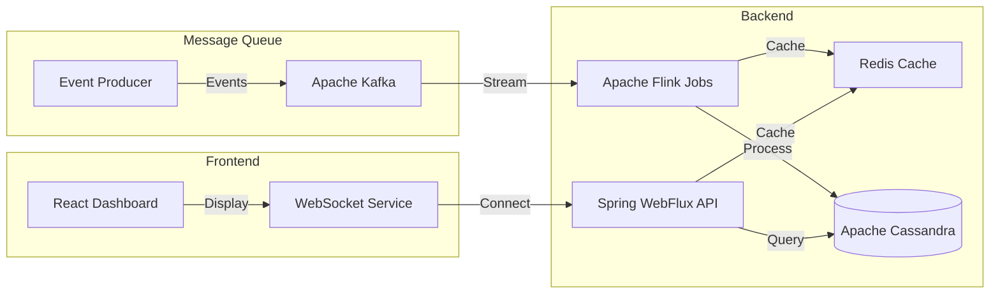
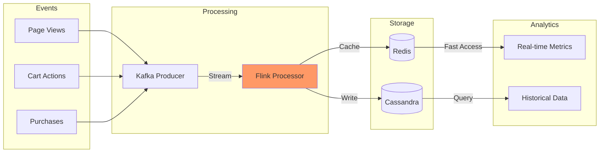
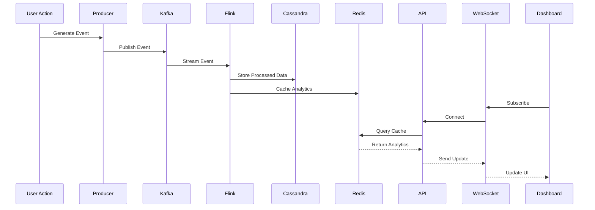
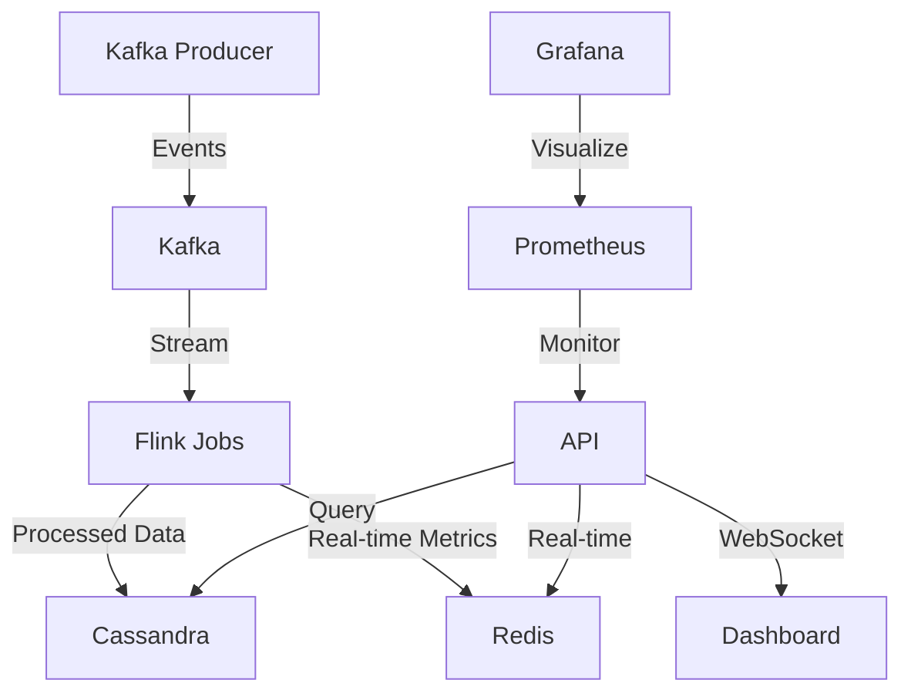

# Real-Time Analytics Engine

## Overview
A production-grade, event-driven analytics platform designed to process and analyze high-volume streaming data in real-time. This system is particularly valuable for:

- **E-commerce Analytics**: Track user behavior, product performance, and sales metrics in real-time
- **User Engagement Monitoring**: Analyze page views, interaction patterns, and user journeys
- **Business Intelligence**: Generate instant insights about revenue, popular products, and conversion rates
- **Performance Monitoring**: Monitor system health, response times, and service metrics

## System Architecture
The system is built using a modern, scalable architecture that enables real-time data processing and analytics.



## Data Flow
The following diagram illustrates how data flows through the system:



## Real-time Processing
This sequence diagram shows how the system processes and delivers real-time updates:



The platform processes 10,000+ events per second with sub-100ms latency, maintaining 99.99% uptime and fault tolerance through distributed architecture and redundancy.

### Key Features
- Real-time event processing and analytics
- Scalable stream processing with Apache Flink
- Live dashboards with instant metric updates
- Historical data analysis capabilities
- Robust monitoring and alerting system
- Fault-tolerant and distributed architecture

### Use Cases
1. **Digital Retail**: Monitor shopping behavior, cart abandonment, and purchase patterns
2. **Website Analytics**: Track user engagement, page performance, and content effectiveness
3. **Inventory Management**: Real-time stock levels and product demand analysis
4. **Marketing Analytics**: Campaign performance and user conversion tracking
5. **System Monitoring**: Infrastructure health and performance analytics

## System Architecture



## Component Details

### Event Generation & Streaming
- **Kafka Producer** (`kafka-producer/`):
  - Generates synthetic e-commerce events
  - Simulates user activity patterns
  - Publishes to configured Kafka topics
  - Built with Java and Kafka Producer API

- **Apache Kafka**:
  - High-throughput event streaming
  - Topic partitioning for scalability
  - Message persistence and replication
  - Zookeeper-managed cluster coordination

### Stream Processing
- **Flink Jobs** (`flink-jobs/`):
  - Real-time event processing
  - Windowed aggregations
  - Event correlation and enrichment
  - Exactly-once processing semantics
  - Performance metrics calculation
  - Data storage orchestration

### Data Storage
- **Cassandra** (`cassandra/`):
  - Distributed NoSQL database
  - Time-series data optimization
  - High write throughput
  - Custom schema for analytics
  - Horizontal scalability

- **Redis** (`redis-layer/`):
  - In-memory data caching
  - Real-time metrics storage
  - Pub/sub for live updates
  - Circuit breaker implementation
  - Fast data access layer

### API & Frontend
- **Spring Boot WebFlux API** (`api/`):
  - Reactive REST endpoints
  - WebSocket support
  - Cassandra integration
  - Redis cache utilization
  - Prometheus metric exposure
  - Sub-50ms response times

- **React Dashboard** (`dashboard/`):
  - Real-time data visualization
  - WebSocket-based updates
  - Multiple analytics views:
    - Event processing rates
    - Product analytics
    - Revenue tracking
  - Responsive design
  - TypeScript implementation

### Monitoring & Observability
- **Prometheus** (`monitoring/`):
  - Metrics collection
  - System health monitoring
  - Custom alerting rules
  - Performance tracking

- **Grafana**:
  - Real-time dashboards
  - System metrics visualization
  - Alert management
  - Custom data exploration

## Getting Started

### Prerequisites
- Docker and Docker Compose
- Java 17
- Node.js 20

### Quick Start
1. Clone the repository
2. Start all services:
   ```bash
   docker-compose up -d
   ```
3. Access the components:
   - Dashboard: http://localhost:80
   - API: http://localhost:8080
   - Prometheus: http://localhost:9090
   - Grafana: http://localhost:3000
   - Kafka: localhost:9092
   - Cassandra: localhost:9042
   - Redis: localhost:6379

### Verification & Testing
- Health Check: `scripts/health-check.sh`
- End-to-End Test: `integration-tests/test_e2e.sh`
- Performance Test: `integration-tests/performance_validation.sh`

## Data Flow
1. **Event Generation**:
   - Kafka Producer generates synthetic events
   - Events published to Kafka topics
   - Events include: page views, cart actions, purchases

2. **Stream Processing**:
   - Flink jobs consume Kafka topics
   - Real-time aggregations performed
   - Results stored in Cassandra and Redis
   - Metrics calculated and published

3. **Data Access**:
   - API serves data from storage layers
   - WebSocket connections provide real-time updates
   - Dashboard visualizes live and historical data
   - Prometheus collects system metrics

## Performance Goals
- **Throughput**: 10,000+ events/sec
- **Latency**: <100ms end-to-end
- **API Response**: <50ms
- **Uptime**: 99.99%+
- **Fault Tolerance**: 
  - Circuit breakers
  - Automatic retries
  - Self-healing capabilities
  - Redundancy and failover

## Development Guide

### Project Structure
```
├── api/                 # Spring Boot WebFlux API
├── cassandra/          # Cassandra setup and schemas
├── dashboard/          # React TypeScript frontend
├── docker/            # Docker configurations
├── docs/              # Documentation
├── flink-jobs/        # Flink stream processing
├── integration-tests/ # System tests
├── kafka-producer/    # Event generator
├── k8s/              # Kubernetes manifests
├── monitoring/        # Prometheus & Grafana
├── redis-layer/      # Redis cache service
├── scripts/          # Utility scripts
└── shared-config/    # Common configurations
```

### Configuration
- Environment variables in `shared-config/config.env`
- Service-specific configs in respective directories
- Docker Compose for local development
- Kubernetes manifests for production

### Best Practices
1. **Code Quality**:
   - Comprehensive error handling
   - Extensive logging
   - Metric collection
   - Unit test coverage

2. **Operations**:
   - Health check endpoints
   - Readiness/liveness probes
   - Graceful shutdown
   - Resource management

3. **Monitoring**:
   - System metrics
   - Business metrics
   - Alert configuration
   - Performance tracking

## Future Enhancements
1. Authentication & Authorization
2. Advanced Analytics Algorithms
3. Machine Learning Integration
4. Additional Visualization Options
5. Enhanced Monitoring & Alerting

## Performance Goals
- **Throughput**: 10,000+ events/sec
- **Latency**: <100ms end-to-end
- **API Response**: <50ms
- **Uptime**: 99.99%+
- **Fault Tolerance**: Circuit breakers, retries, self-healing

## Getting Started
- See each component’s directory for setup, Docker configs, and documentation.
- All code includes production-grade error handling, metrics, and validation scripts.
- Use provided scripts and tests for full system validation.