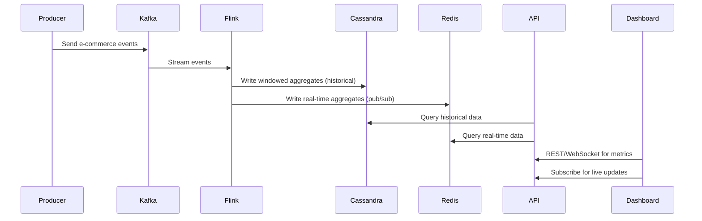

# Event Flow Documentation

## Sequence Diagram

## Data Flow
- Events generated by Kafka Producer
- Flink jobs consume Kafka topics, process with windowing, output to Cassandra and Redis
- API service reads from Cassandra (historical) and Redis (real-time)
- Dashboard fetches metrics via API and receives live updates via WebSocket
- Monitoring stack (Prometheus/Grafana) tracks metrics across all services

## Error Handling & Circuit Breakers
- All services use consistent event schemas
- API falls back to Cassandra if Redis unavailable
- Circuit breaker patterns in Redis/Service layers
