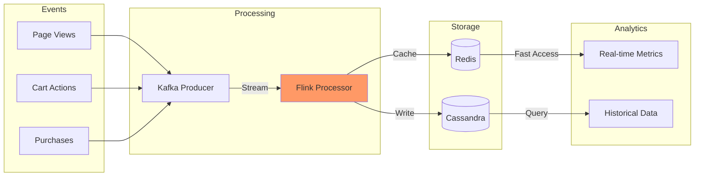

```mermaid
flowchart LR
    subgraph Events
        PV[Page Views]
        CA[Cart Actions]
        P[Purchases]
    end

    subgraph Processing
        KP[Kafka Producer]
        F[Flink Processor]
        style F fill:#f96
    end

    subgraph Storage
        C[(Cassandra)]
        R[(Redis)]
    end

    subgraph Analytics
        RT[Real-time Metrics]
        H[Historical Data]
    end

    PV & CA & P --> KP
    KP -->|Stream| F
    F -->|Write| C
    F -->|Cache| R
    R -->|Fast Access| RT
    C -->|Query| H
```
