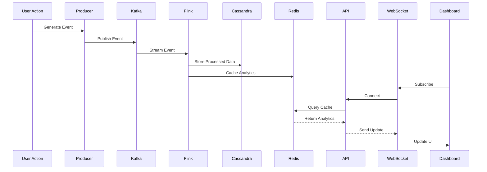

```mermaid
sequenceDiagram
    participant U as User Action
    participant P as Producer
    participant K as Kafka
    participant F as Flink
    participant C as Cassandra
    participant R as Redis
    participant A as API
    participant W as WebSocket
    participant D as Dashboard

    U->>P: Generate Event
    P->>K: Publish Event
    K->>F: Stream Event
    F->>C: Store Processed Data
    F->>R: Cache Analytics
    D->>W: Subscribe
    W->>A: Connect
    A->>R: Query Cache
    R-->>A: Return Analytics
    A-->>W: Send Update
    W-->>D: Update UI
```
