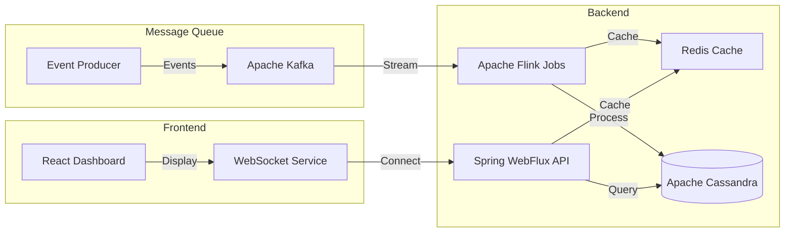

```mermaid
flowchart LR
    subgraph Frontend
        Dashboard[React Dashboard]
        WebSocket[WebSocket Service]
    end

    subgraph Backend
        API[Spring WebFlux API]
        Flink[Apache Flink Jobs]
        Redis[Redis Cache]
        Cassandra[(Apache Cassandra)]
    end

    subgraph Message Queue
        Kafka[Apache Kafka]
        Producer[Event Producer]
    end

    Producer -->|Events| Kafka
    Kafka -->|Stream| Flink
    Flink -->|Process| Cassandra
    Flink -->|Cache| Redis
    API -->|Query| Cassandra
    API -->|Cache| Redis
    WebSocket -->|Connect| API
    Dashboard -->|Display| WebSocket
```
